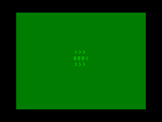
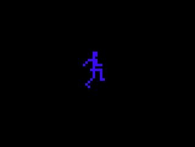
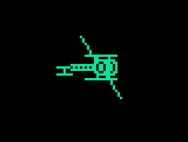
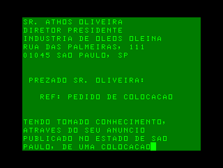

# INPUT (BR), vol. 1, no. 1

## Código de máquina 1:   Programação em código da máquina

(🔗📖🇬🇧 [vol. 1, no. 3, pag. 0065](https://archive.org/details/Input_Vol_1_No_03_1997_Marshall_Cavendish_GB/page/n2/mode/1up))

### [pag.0002.bas](pag.0002.bas)

Comparação entre a velocidade do BASIC e do código de máquina em preencher a memória de vídeo com caracteres aleatórios (dados quaisquer obtidos da ROM).

### [pag.0003.bas](pag.0003.bas)

Demonstração da velocidade do código de máquina em preencher a memória de vídeo com blocos coloridos aleatórios (dados quaisquer obtidos da ROM).

## Programação de jogos 1:    Animação e sinais gráficos

(🔗📖🇬🇧 [vol. 1, no. 1, pag. 0026](https://archive.org/details/Input_Vol_1_No_01_1997_Marshall_Cavendish_GB/page/n27/mode/1up))

### [pag.0005-1.bas](pag.0005-1.bas)

Animação em dois quadros de um satélite desenhado com caracteres de blocos.

### [pag.0005-2.bas](pag.0005-2.bas)

Animação de um inseto desenhado com caracteres ASCII atravessando a tela e movendo as pernas.

### [pag.0006.bas](pag.0006.bas)

Animação de um corredor desenhado com caracteres de bloco atravessando a tela. (Não existe programa original, apenas os desenhos do corredor e a sugestão de que o leitor fizesse o programa.)

### [pag.0008.bas](pag.0008.bas)

Animação em dois quadros de um dançarino desenhado com caracteres de bloco.

### [pag.0010.bas](pag.0010.bas)

Animação em dois quadros de um helicóptero desenhado com caracteres de blocos. (O programa original usava caracteres gráficos.)

## Programação BASIC 1:    Números ao acaso

(🔗📖🇬🇧 [vol. 1, no. 1, pag. 0002](https://archive.org/details/Input_Vol_1_No_01_1997_Marshall_Cavendish_GB/page/n3/mode/1up))

Demonstrações do uso de `RND`.

### [pag.0013.bas](pag.0013.bas)

Jogo de adivinhação de um número (0–5) sorteado pelo computador.

### [pag.0015.bas](pag.0015.bas)

Teste de conhecimento de tabuada de multiplicação por 9.

## Aplicações 1   Escreva cartas sem esforço

(🔗📖🇬🇧 [vol. 1, no. 4, pag. 0124](https://archive.org/details/Input_Vol_1_No_04_1997_Marshall_Cavendish_GB/page/n29/mode/1up))

### [pag.0019.bas](pag.0019.bas)

Programa que formata e imprime na tela e/ou impressora uma carta a partir de linhas DATA.

