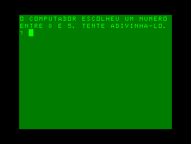
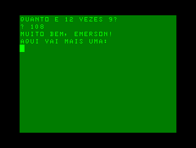

# INPUT (BR), vol. 1, no. 1

## Código de máquina 1:   Programação em código da máquina

### [pag.002.bas](pag.002.bas)

Comparação entre a velocidade do BASIC e do código de máquina em preencher a memória de vídeo com caracteres aleatórios (dados quaisquer obtidos da ROM).

### [pag.003.bas](pag.003.bas)

Demonstração da velocidade do código de máquina em preencher a memória de vídeo com blocos coloridos aleatórios (dados quaisquer obtidos da ROM).

## Programação de jogos 1:    Animação e sinais gráficos

### [pag.005-1.bas](pag.005-1.bas)

Animação em dois quadros de um satélite desenhado com caracteres de blocos.

### [pag.005-2.bas](pag.005-2.bas)

Animação de um inseto desenhado com caracteres ASCII atravessando a tela e movendo as pernas.

### [pag.006.bas](pag.006.bas)

Animação de um corredor desenhado com caracteres de bloco atravessando a tela. (Não existe programa original, apenas os desenhos do corredor e a sugestão de que o leitor fizesse o programa.)

### [pag.008.bas](pag.008.bas)

Animação em dois quadros de um dançarino desenhado com caracteres de bloco.

### [pag.010.bas](pag.010.bas)

Animação em dois quadros de um helicóptero desenhado com caracteres de blocos. (O programa original usava caracteres gráficos.)

## Programação BASIC 1:    Números ao acaso

### [pag.013.bas](pag.013.bas)

Jogo de adivinhação de um número (0–5) sorteado pelo computador.

### [pag.015.bas](pag.015.bas)

Teste de conhecimento de tabuada de multiplicação por 9.

