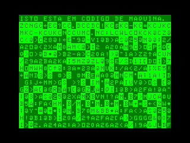

# INPUT (BR) vol. 1, no. 1

## Código de máquina 1  
## Programação em código da máquina

### 

Comparação entre a velocidade do BASIC e do código de máquina em preencher a memória de vídeo com caracteres aleatórios (dados quaisquer obtidos da ROM).

### 

Demonstração da velocidade do código de máquina em preencher da tela com blocos coloridos aleatórios (dados quaisquer obtidos da ROM).

## Programação de jogos 1  
## Animação e sinais gráficos

Animação em dois quadros de um satélite desenhado com caracteres de blocos.

