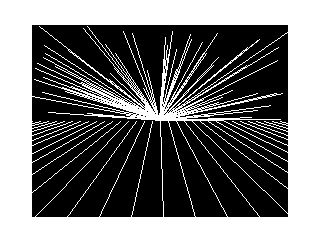
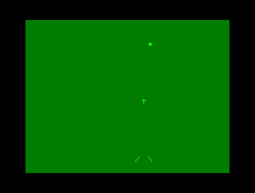

# INPUT (BR), vol. 1, no. 2

## Programação BASIC 2:   A arte de fazer laços

Demonstração de usos de laços `FOR`.

### [pag.022.bas](pag.022.bas)

Geração de um tom sonoro de frequência variável.

Como variação ([pag.022-extra.bas](pag.022-extra.bas)), me inspirei no programa para MSX. O MSX, o comando `SOUND` carrega valores diretamente nos registradores do processador de som PSG AY-3-8910. Para fazer o mesmo no MC-1000, foi preciso recorrer a código de máquina. Assim, `SOUND <registrador>, <valor>` foi substituído por `<var> = USR(<registrador> * 256 + <valor>)`.

IMPORTANTE: No registrador 7 (mixer) é preciso sempre manter o bit 7 como 0 e o bit 6 como 1, para que o teclado funcione corretamente. Por isso se soma 64 (0b01000000) ao valor desejado para os demais bits.

### [pag.023.bas](pag.023.bas)

Preenchimento da tela com pontos coloridos.

### [pag.025-1.bas](pag.025-1.bas)

Desenho de um pôr-do-sol com linhas.

### [pag.025-2.bas](pag.025-2.bas)

Desenho de padrão caleidoscópico.

## Programação de jogos 2   Apontar... fogo!

Demonstrações de captura de teclas com `INKEY$` e movimentações.

### [pag.032.bas](pag.032.bas)

Jogo de tiro ao alvo.

