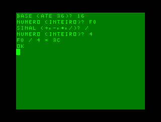

# INPUT (BR), vol. 1, no. 2

## Programação BASIC 2:   A arte de fazer laços

Demonstração de usos de laços `FOR`.

### [pag.0022.bas](pag.0022.bas)

Geração de um tom sonoro de frequência variável.

➕ VERSÃO EXTRA com ⚙️ CÓDIGO DE MÁQUINA ADICIONADO ([pag.0022-extra.bas](pag.0022-extra.bas)) inspirada na versão para MSX, onde o comando `SOUND` carrega valores diretamente nos registradores do processador de som PSG AY-3-8910. Assim, `SOUND <registrador>, <valor>` foi substituído por `<var> = USR(<registrador> * 256 + <valor>)`.

⚠️ IMPORTANTE: No registrador 7 (mixer) é preciso sempre manter o bit 7 como 0 e o bit 6 como 1, para que o teclado funcione corretamente. Por isso se soma 64 (0b01000000) ao valor desejado para os demais bits.

### [pag.0023.bas](pag.0023.bas)

Preenchimento da tela com pontos coloridos.

### [pag.0025-1.bas](pag.0025-1.bas)

Desenho de um pôr-do-sol com linhas.

### [pag.0025-2.bas](pag.0025-2.bas)

Desenho de padrão caleidoscópico.

## Programação de jogos 2   Apontar... fogo!

Demonstrações de captura de teclas com `INKEY$` e movimentações.

### [pag.0032.bas](pag.0032.bas)

Jogo de tiro ao alvo.

⚙️ CÓDIGO DE MÁQUINA ADICIONADO: A versão para MC-1000 usa o pacote [RotinasUSR](https://github.com/ensjo/mc1000-software/tree/master/emerson/RotinasUSR) para superar o bloqueio do interpretador BASIC quando uma tecla é pressionada e para disponibilizar uma função semenhante à `INKEY$`.

## Código de máquina 2   Aprenda a contar com um dedo só

### [pag.0035.bas](pag.0035.bas)

“Calculadora” para múltiplas bases numéricas.

### [pag.0038.bas](pag.0038.bas)

Conversão de números fracionários (0 a 1, exclusive) para binário.

