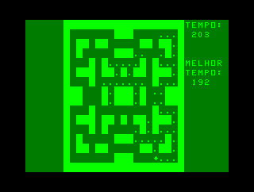

# INPUT (BR), vol. 1, no. 3

## Programação BASIC 3:   Ensine seu micro a tomar decisões

(🔗📖🇬🇧 [vol. 1, no. 2, pag. 0033](https://archive.org/details/Input_Vol_1_No_02_1997_Marshall_Cavendish_GB/page/n2/mode/1up))

Demonstrações do uso de `IF`...`THEN`...`ELSE`.

### [pag.0043.bas](pag.0043.bas)

Máquina caça-níqueis.

## Programação de jogos 2:   Divirta-se com labirintos

(🔗📖🇬🇧 [vol. 1, no. 3, pag. 0068](https://archive.org/details/Input_Vol_1_No_03_1997_Marshall_Cavendish_GB/page/n5/mode/1up))

Jogo de “come-come” em labirinto.

### [pag.046.bas](pag.046.bas)

🕹️ CONTROLES: &lt;W>, &lt;A>, &lt;S>, &lt;D>.

⚙️ CÓDIGO DE MÁQUINA ADICIONADO: A versão para MC-1000 usa o pacote [RotinasUSR](https://github.com/ensjo/mc1000-software/tree/master/emerson/RotinasUSR) para superar o bloqueio do interpretador BASIC quando uma tecla é pressionada e para disponibilizar uma função semenhante à `INKEY$`.

## Periféricos   Como descomplicar `SAVE`s e `LOAD`s

(🔗📖🇬🇧 [vol. 1, no. 1, pag. 0022](https://archive.org/details/Input_Vol_1_No_01_1997_Marshall_Cavendish_GB/page/n23/mode/1up))

Comandos e dicas para leitura, gravação, verificação etc.

## Código de máquina 2:   Aprenda aritmética hexadecimal

(🔗📖🇬🇧 [vol. 1, no. 4, pag. 0110](https://archive.org/details/Input_Vol_1_No_04_1997_Marshall_Cavendish_GB/page/n15/mode/1up))

### [pag.0035.bas](pag.0035.bas)

“Calculadora” para múltiplas bases numéricas.

